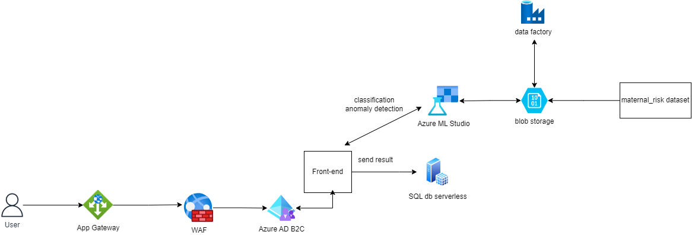

# Maternal Health (T20 Project)

## Introduction
Through the Web application, we aim to help pregnant women track their maternal health and predict potential risk based on age, blood pressure, blood glucose and heart rate using a pre-trained classification machine learning model. The user data is collected through both IoT device and inputs prompted through the app UI. Dashboard is displayed for users to monitor the trend of their maternal health metircs and predicted risk level on a daily basis. Alerts are sent to users (through SMS) once abnormal metric is detected. 

## Architecture Overview

## Project Plan
### Objectives
* Build supervised Machine Learning models to predict maternal risk for users, on the existing dataset
* Build an anomaly detection model on the maternal health dataset
* Select and validate the optimal models based on the Precision/Recall rates 
* Deploy the optimal models to new data from input/IoT
* Configure the trigger in the App to send alert SMS
* Configure data storage for different components
* Configure Azure Action Directory for the app and other security components

### About the data
* [Maternal Health Risk Dataset](https://www.kaggle.com/datasets/csafrit2/maternal-health-risk-data) (hosted on Kaggle) contains information of age, systolic blood pressure, diastolic blood pressure, blood glucose, heartrate and risk level from 1014 women. The data is collected from different hospitals and clinics. Risk level is classified by the experts.
* Data from users for prediction and trend analysis is collected on a daily basis through IoT devices and user inputs through the App

### Modeling techniques
* Classfication Models: XGBoost, LightGBM, Random Forest models are tried out. Normalization tools including Standard Scaler, Sparse Normalizer, Max Abs Scaler are tested. Ensemble methods including voting and stacking are also used for improved accuracy.
* Anomaly Detection models: Support Vector Machine, Decision Trees, and K Nearest Neighbor models are examined to find the optimal result.

### Software Frameworks
TBD

## Application
[Our App's Site](https://t20-app.azurewebsites.net/) (*In Development*)

## Notebook & Resources
[T20 Notebook](https://microsoft-my.sharepoint.com/:o:/p/ashwinse/EogkyHHf01BPg6eagl_1lB0BNoCmUrUQUJMD_Ev7TIAf5g?e=bfvpi3)

## Specialities
- AI/ML: Melody
- App: Ana & Ashwin
- Data: Rachel, & Melody
- Networking: Zach
- IoT: Aayushi?
- Security: Aayushi, Ana, & Zach

## Overall Concept:
- An IoT device based upon (maternal/breast cancer TBD) data
- IoT device has sensors that ideally transmit data
- Data is stored
- Data is processed with AI to create predictions
- Users login to see their specific data
- Users use app via web
- Data is health-based app data (specifics are TBD dependent upon DB)

## Timeline
### First Sprint (10/3 - 10/7)
- Architecture Design
- Database
- Deploy Web App (i.e., front-end)
- Security (i.e., AAD B2C sign-in)
### Second Sprint (11/10 - 11/21)
- Network Security (e.g., Application Gateway, WAF, NSGs)
- Deploy new UI
- Deploy ML Model   
- Connect Database with Web App
### Third Sprint (11/30 - 12/9)
- TBD

##### All development complete before Dec.

## Project Steps

#### Database
- [X] Find & cleanse DB
#### App
- [X] Create Skeleton App
- [X] Create login permissions (e.g., create users)
- [ ] Add sign-in features
- [X] Connect to DB
- [X] Read from database / read-only specific user data
- [ ] Display user data on UI
- [X] Configure Web App Gateway
- [X] Configure network security features (e.g., NSGs, WAF)
#### AI
- [X] Train data
- [X] Find optimal models
- [X] Create predictions
- [X] Deploy & test models
#### Storage
- [X] Create DB
- [X] Connect to app
- [ ] Process & manage data
#### Future Considerations
- [ ] TBD

## Original Project Proposal
[Original T20 Proposal](https://microsoft-my.sharepoint.com/:w:/p/wanchenliu/EcsrYwyAj69AnhiXRGwDBh4BdOyCXd6ZhlzMOdW-g8Uldw?e=GXkAah)

## Resources
[Amanda's Project's Github Repo](https://github.com/wongamanda/image-captioning)

[Amanda's Project Write-Up](https://towardsdatascience.com/building-a-deep-learning-image-captioning-model-on-azure-b14ce4682fbf)

[Devanshi's Project Proposal](https://microsoft-my.sharepoint.com/:w:/p/dthakar/EeFrZf0ZpdlBlt4MBYVc_1gBspeGARu8fmS8PoOIv08JoA)

[Devanshi's Project Write-Up](https://devanshithakar.medium.com/create-your-own-vehicle-recognition-system-with-azure-custom-vision-7d3ad14fd43)
